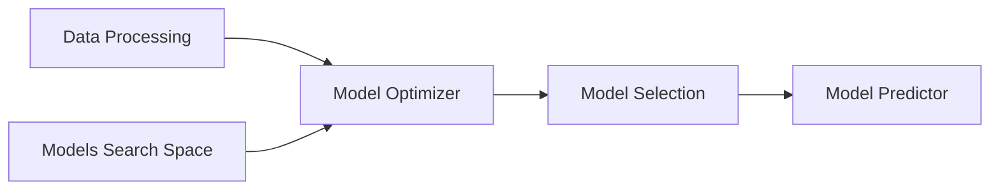

# Credit Risk Modeling

This project intends to model credit risk by using machine learn algorithms. The dataset used was the [UCI German Credit Dataset](https://archive.ics.uci.edu/ml/datasets/statlog+(german+credit+data)). The solution is built with Python, Streamlit and Botorch, mainly. 


## Requirements 
* Docker
* Python
* Streamlit
* Ax Platform

## How to run 

In order to run the app, type the following command in your terminal to build and run the docker containers:
```
$ docker-compose up -d --build
```
And then you access the app on `http://localhost:8501/` 
## DS solution

First the data is processed  to get ready to be used by models. Then,  data optimizer used bayesian algorithms to select the most suitable set of parameters for each model. After that, the best model is selected from trained models and is ready to be consumed on the prediction phase. 